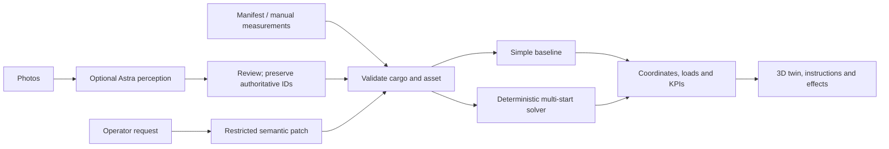

# Packwise Cargo: enterprise MVP

## Frozen one-day concept

Cargo knowledge and operator intent become explicit constraints, then an inspectable load plan. The hero is one rigid rear-door truck with 20 mixed pallets/crates and three illustrative stops. The pitch: “Most loading demos show boxes fitting. Packwise shows whether the right shipment can come out when the operation changes.” This is a product thesis, not a market-exclusivity claim.

## Existing implementation audit

The starting version had working 3D geometry, rotation/compression, collision/top-entry checks, support and propagated loads, manual editors, photos, strict AI interpretation, a baseline, playback and 17 passing tests.

| Decision | Modules and rationale |
|---|---|
| Reused unchanged | Shadcn/Base UI primitives; routing/build/deployment setup; original regression tests and consumer fixtures. |
| Reused and extended | Solver/model, Three.js scene, editors, photo review, server Responses transport. Geometry, forms, orbit controls and resource disposal remain useful. |
| Terminology/context | Item→cargo; bag→transport asset; packing→load planning; depth→length; enterprise values and m³ display. Internal compatibility names avoid churn. |
| Architectural changes | Rear-door insertion/extraction; first-unload constraint; payload/floor limits; stackability; stop obstructions; cargo search orders; quantity-expanded manifests; provenance and merge precedence. |
| New primary surface | KPIs, truck twin, cargo intelligence, intent patch and actual deltas, searchable manifest and instructions. |
| Removed from product flow | Weekend narrative, headphones, backpack bulging/comfort scores, speculative trip savings and redundant mode dashboards. Legacy behavior remains tested. |

## Priorities

**Must build — implemented:** enterprise models and terminology, editable dimensions/mass/handling, deterministic optimization, payload/stack/floor checks, 3D load, measured metrics, instructions and optional structured AI.

**High value — implemented:** fair baseline, P14 natural-language replan, stop obstructions, playback, layer separation, COM, JSON import/export, Impeccable guidance/review.

**Skip:** extra transport dashboards, exact optimization, fleet routing, account administration, certified compliance subsystems, dangerous-goods database, FEA, cloth simulation and photorealistic meshes.

## Data and authority

`TransportAsset` aliases compatible `Container`: [width,height,length] cm, rear opening [width,height], payload kg, expansion=0, optional floor kg/m² and kind. The door is centred/floor aligned. Truck/container boxes share geometry; the truck is the hero.

`CargoUnit` aliases `Item`: ID/name, external dimensions including pallet, mass, rigidity/orientation, required flag, stackability/top load, destination/stop, first-unload flag and provenance. Quantity expands into unique units before solving. Limits: 30 units and 20 numbered stops.

Sources are sample, manifest, manual or AI estimate. Existing IDs retain every authoritative property during photo merge. New inferred units remain labelled estimates after review. Corrected photo dimensions mark dimension provenance manual; full editor saves mark reviewed fields manual. Operator rules update handling provenance. No independent verification is implied.

## Architecture

Offline rules never pose as a live model. Astra handles semantics and uncertainty, never coordinates or KPI improvements. Unknown IDs, duplicate changes and invalid output fail before mutation. Unsupported regulatory/fleet requests return no change. Revision checks prevent stale asynchronous interpretation from overwriting edits.

## Geometry and objective

Allowed orientations and wall/existing-face coordinates define candidates. Low/deep placement preferences include mass/balance terms. Checks reject overlap, payload excess, door violations, blocked straight rear insertion, insufficient support, top-load excess and floor overload. Support requires 80% footprint contact and a supported projected centre; loads propagate downward by contact-area shares.

A first-unload unit requires no rear corridor blocker and no cargo above its footprint. Later placements cannot invalidate this. It is a hard constraint, not merely a near-door score. Loading order obeys insertion checks; replan animation illustrates movement.

Cargo search evaluates 22 seeded order variants plus baseline. Required-unit count precedes total count; occupied volume and quality break ties. Quality includes lateral/longitudinal COM, extraction access, later-stop blockers and COM height. This bounded heuristic can miss feasible arrangements. Both algorithms use identical constraints.

## Measured synthetic scenario

| Metric | Simple | Optimized |
|---|---:|---:|
| Loaded | 14 / 20 | 20 / 20 |
| Cargo mass | 5,220 kg | 7,300 kg |
| Cubic utilization | 50.5% | 72.0% |
| Occupied volume | 17.46 m³ | 24.90 m³ |
| Payload utilization | 52.2% | 73.0% |
| Unused bounding volume | 17.10 m³ | 9.66 m³ |

Simple loading encounters non-stackable crates early. Optimization rearranges the same cargo under the same checks. No industry savings or vehicle-count claim follows.

P14 extraction blockers fall from 2 to 0; all 20 units remain loaded at 72.0%. Same-target access rises from 33.3 to 100. The KPI becomes Priority access and overall later-stop blocker pairs remain visible; all-stop access is not perfect.

Cubic utilization uses occupied bounding volume/capacity; payload uses mass/capacity. Legacy `metrics.volume` is litres, displayed in m³; exports identify both units. COM is mass weighted in cm. Front/rear figures split cargo mass across geometric halves and are not axle reactions. Floor loads use full footprints. Blocker pairs are not measured handling time. More loaded units can worsen access; show that tradeoff.

## Strict rubric risks

These are engineering judgments, not predicted judge scores.

| Rubric | Strongest evidence | Biggest risk to 9–10 | Best next proof |
|---|---|---|---|
| Originality | Semantic rules produce a geometric counterfactual. | Bin packing is established; a chat wrapper is insufficient. | Show the patch and real P14 change; evaluate an unprepared runtime request. |
| Presentation | Dispatch console, dominant 3D, comparison, playback and manifest. | Audience misses the operational story or assumes a mockup. | Rehearse 90 seconds and point to 2→0 blockers. |
| Usefulness | Authoritative data, quantities, payload/stack/floor checks and failure reasons. | Synthetic data, simplified clearances and no customer validation. | Validate an anonymized real manifest with a loading supervisor. |
| Technical complexity | Insertion/extraction, load propagation, multi-start search, strict AI and regressions. | No exact optimum or live vision benchmark. | Show invariants and explain the semantic/deterministic split. |

Real-manifest and live-AI evaluation is the strongest remaining investment, not another transport mode.

## Impeccable

Installed official Impeccable 4.2.2 through its CLI. Initial context loading could not fetch a verified Windows engine; verification was not bypassed. The later single detector run succeeded and its width-animation warning was corrected. A fresh finish reviewer scored all three requested fixes resolved. See validation record for scope; no second detector or clean-detector claim. [Official project](https://github.com/pbakaus/impeccable).
