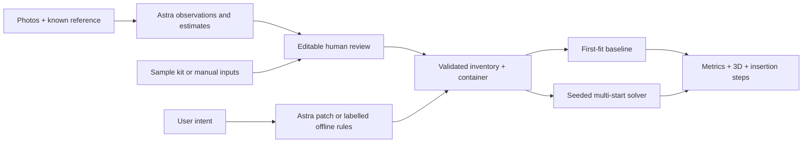

# Packwise — one-day product and engineering decision

## Rubric assessment

| Strict category      | Biggest barrier to a 9–10                            | Our response                                                                                                                         |
| -------------------- | ---------------------------------------------------- | ------------------------------------------------------------------------------------------------------------------------------------ |
| Originality          | A familiar vision demo followed by bin packing       | Intent becomes physical constraints; show a real counterfactual with moved items, retrieval blockers, and measured trade-offs.       |
| Presentation         | Too many controls and invisible reasoning            | One workbench: inventory → 3D model → computed comparison → a single natural-language request → packing steps.                       |
| Usefulness           | Incorrect measurements or a physically unusable plan | Editable estimates, separate opening measurement, conservative support/load checks, clear failures and remedies.                     |
| Technical complexity | An LLM wrapper or unsupported physics claims         | Deterministic seeded search, geometric checks, static load propagation, COM, common baseline evaluation, and independent invariants. |

These choices aim at high scores; they do not guarantee a score or claim that packing optimization itself is new.

## Frozen MVP scope

**Must build today:** one backpack hero; labelled offline sample; editable item and bag properties; optional server-side Astra perception and intent; photo review before application; typed/validated contracts; rotations, bounded compression and depth expansion; collision, opening, weight, support, load and insertion checks; reproducible multi-start solver; same-constraint first-fit baseline; interactive 3D; physical metrics; replan suggestions; failure reasoning; packing instructions; reset and JSON export.

**Should build if time allows:** moved-item highlighting, exploded view, packing playback, safeguards against stale API responses, responsive layout, API transport tests.

**Do not build unless ahead:** cloth simulation, photogrammetry, photorealistic object meshes, learned optimizer, warehouse modes, accounts, cloud photo storage, voice capture, arbitrary locked positions, dedicated laptop compartments. Those add implementation and validation risk before improving the main demonstration.

The user clarified that Astra is the engineering model in Codex and runtime AI is optional. A runtime API key is not necessary for the complete sample/manual flow. Demo data and rules must never be presented as live perception.

## Architecture and data flow

Vinext/React + TypeScript; Three.js renderer; pure TypeScript geometry/optimization; optional server-only OpenAI Responses adapter. State and photos live in browser memory. No cloud photo persistence.



Astra owns perception, conservative property inference, uncertainty, and translation of user intent. It does not assign authoritative coordinates or invent metric improvements. The deterministic solver owns geometry, physics proxies, scoring and instructions grounded in placements. In offline mode only the advertised intent patterns are supported; unknown requests produce an actionable limitation.

## Canonical contracts

See `lib/packing/model.ts` and `lib/astra/schemas.ts`.

- Units: cm, kg, litres, Nm. Axes: x=left→right, y=bottom→opening, z=back panel→front.
- `Item`: id, name, dimensions `[width,height,depth]`, mass, colour, rigidity, minimum retained volume ratio, fragility, allowed orientation, access priority, required flag, maximum load on top, source, confidence, notes.
- `Container`: name, internal dimensions, rectangular opening width/depth, mass limit, allowed depth expansion fraction.
- `Placement`: item, minimum-corner position, actual packed dimensions, original-axis permutation, retained volume ratio, insertion order.
- `Plan`: placements, excluded items with reasons, effective envelope, metrics, search count, mode and required-item completeness.
- `IntentPatch`: restricted item IDs with access/fragility/removal changes, comfort/protection priority switches, and a no-expansion preference.

Quantity is represented as separate item instances via Add item, except explicit aggregate proxies such as the sample pair of shoes and folded shirt stack. No hidden quantity multiplier.

Dimensions, mass, compression ratios, enum values and IDs are validated. Photo inference is a separate review draft and cannot silently overwrite manual inventory. Editing an item marks it as user-reviewed; confidence is provenance metadata, not measurement accuracy.

## Packing algorithm

Baseline: input-order first feasible placement, evaluated at the same permitted envelopes as optimization. It obeys the same physics checks and compression bounds.

Optimizer: 14 deterministic orderings per envelope (large-first, heavy-first, nonfragile-first, seeded shuffled alternatives); extreme-coordinate candidates from surfaces and boundaries; up to six orthogonal rotations; uncompressed/intermediate/minimum soft-item compression; nominal/half/max permitted depth expansion. Include every baseline candidate in the optimized search. A fixed seed makes the demo reproducible.

Selection is lexicographic: required items packed, then total count, then quality. It is a finite heuristic, not a proof of optimality or infeasibility. Every returned arrangement satisfies the implemented checks.

### Hard constraints

- AABB containment and no positive-volume intersections.
- Bag mass within the user limit.
- Upright/flat preserve the original vertical axis; any permits axis permutations.
- Rigid compression ratio 1; soft compression never below the approved minimum (at least 0.4).
- Packed cross section fits the measured rectangular opening; no rotation during insertion.
- No existing object above the candidate's horizontal footprint during insertion.
- At least 80% base contact, with the projected centre over a supporting item.
- Contact-area load splitting and propagation to lower supports; no item exceeds its entered maximum top load.

Opening cross-section and internal vertical path checks are separate conservative approximations. Opening location, zipper curvature, tilting, and lateral maneuvers at the rim are not modeled; do not claim full motion planning. The opening does not automatically grow when depth expands.

### Soft scoring and metric definitions

- Volume occupied: sum of packed proxy volumes. Utilization = occupied / effective envelope ×100. Less compression can raise this metric; higher is not always better when all items fit.
- COM: sum(mass × box centre) / packed mass.
- Lateral balance: `100 × (1 − 2 × |COM.x − width/2| / width)`, clamped 0–100.
- Rear moment proxy: `sum(mass × depth-centre) × 9.81 / 100` Nm. Lower brings weight nearer the back; not an ergonomic rating.
- Access: for each immediate-access item, `100/(1+overhead blockers) × (0.65+0.35×item top/bag height)`; average all packed items when none is immediate.
- Protection proxy: fragile-item wall clearance (up to 35 points), 35 for the enforced load checks, and 30 for a soft proxy within 2 cm. This is not a damage probability or proof of wrapping. With no fragile items it is 100 as not applicable.
- Quality: weighted average of comfort (`0.4×balance + 0.6×rear-closeness`), access and protection, minus `0.25×compression percentage + 0.65×depth expansion percentage`.

Compare item counts first: quality metrics describe only the packed subset. Before/after intent deltas re-evaluate the old arrangement against the new access targets so a denominator change cannot fabricate an improvement. Removal requests change the kit; interpret total mass/moment changes accordingly.

## User interface

Travel equipment workbench: white control panels, navy type, a mineral-blue 3D stage, emerald primary actions, distinct item colours. Inventory on the left; dominant 3D centre; measured comparison on the right; intent bar and ordered packing cards below. On mobile the model comes first and controls stack. Inventory selection and textual steps provide an alternative to pointer-based 3D interaction.

## Hero demonstration / wow moment

90 seconds:

1. Load the explicitly labelled weekend sample or analyze real photos if runtime Astra is configured. Show editable measurements.
2. Toggle First fit → Optimized. Show the actual change in item count and physical metrics.
3. Orbit the model. Identify the laptop, fragile camera and COM marker.
4. “I need my headphones during the flight.” The solver rearranges the bag, highlights moved items, and reports actual same-target access and moment changes. Do not promise every metric improves.
5. Play the insertion sequence; select the camera to see its computed top load.
6. Set the opening depth to 5 cm. Show explicit opening failures and remedies; reset.
7. Explain how the same semantic-to-constraint architecture extends to emergency kits or parcels without building extra modes.

For an AI-focused judging session, configure and rehearse live photo/intent calls before presenting. For runtime/network failure, switch honestly to the sample kit. Never describe the offline parser as an LLM response.

## Implementation order and one-day budget

1. Scaffold/theme/recognizable preview (30 min).
2. Models, fixtures, geometry and invariant tests (90 min).
3. Solver, baseline, shared metrics (60 min).
4. Complete editor→solver→3D→instructions integration (120 min).
5. Runtime API/photo review and intent patches (60 min).
6. Failure cases, exports, polish and regression checks (60 min).
7. Build, private hosting, demo rehearsal and contingency (60 min).

## Source layout

```
app/page.tsx                  entry
app/globals.css               design tokens / responsive styles
app/api/astra/route.ts         server-only optional API
components/packing/Planner    integrated state / comparison / replanning
components/packing/Scene      Three.js geometry / picking / playback
components/packing/Editors    item and bag review
components/packing/PhotoInput  photo upload / estimates review
lib/packing/model             contracts / validation
lib/packing/demo              labelled fixtures
lib/packing/solver            geometry / load / search / evaluation
lib/packing/intent            restricted offline patches
lib/astra                     structured output schemas and transport
tests                         solver invariants / intent / API contracts
docs                          brief and runbook
```

## Approximations and mocks

Mocked: sample observations are authored fixtures; test API transport returns a fixture. Runtime-disabled UI is explicit. No fabricated optimizer metrics.

Approximated: bounding boxes, one-axis fabric compression, depth-only bag expansion, static support/load splitting, COM/moment, nearby-soft-item protection. No mesh reconstruction, zipper motion planning, dynamic impacts, material stresses, strap forces or comfort certification.

Live API validation requires a configured API key and model access; passing mocked transport tests is not a live API test.

Official API sources checked during implementation: [Astra](https://developers.openai.com/api/docs/models/gpt-6-astra), [Structured outputs](https://developers.openai.com/api/docs/guides/structured-outputs), [Image input](https://developers.openai.com/api/docs/guides/images-vision).
